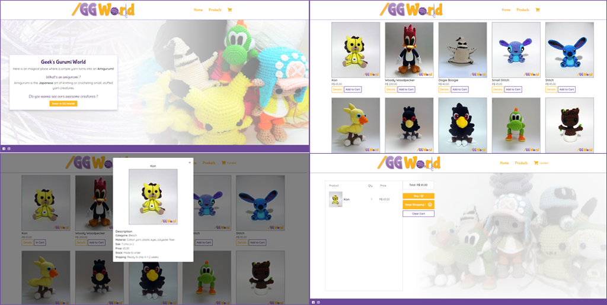

# /GG World

A Geek's Gurumi World é um e-commerce para encomendas de amigurumis (técnica artesanal japonesa para croche).

## Motivo

Este é o produto final do sprint 5 do bootcamp Laboratoria.

O desafio era criar uma SPA (Single Page Application), usando pelo menos uma API e tema livre.
Neste caso, o firebase foi usado de certa forma a simular um request de API.

## Tecnologias usadas
* HTML5
* CSS3
* Bootstrap
* Javascript
* JQuery
* Lodash
* Firebase
* Photoshop
* Illustrator

## Aparência

## Oficial Roadmap

### Versão 3.0.0
- Implementação de API do paypal para efetuar a compra no botão "buy".

### Versão 2.0.0 (dezembro 2018)
- Verificar se o produto já existe no carrinho para não adicionar produto duplicado.
- Implementação de botões individuais de exclusão do carrinho.
- Implementação de botão para selecionar a quantidade de cada produto.

### Versão 1.0.0 (lançada)
- A página inicial tem uma breve explicação sobre o tema amigurumi.
- Na página de produtos, aparece todos os modelos disponíveis com dois botões, um para mais detalhes sobre o produto, outro para enviar para o carrinho, onde já aparece o valor total da compra e um botão para continuar comprando ou limpar o carrinho.
